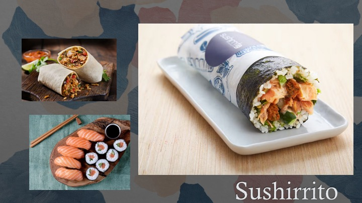

# The Sushirrito

## Origins

## Contributors

## Parent Dishes

## References

Gabriele, Amanda. "The Origins of the Sushi Burrito: Q&A with the Inventor". *The Manual*, April 1, 2019. [https://www.themanual.com/food-and-drink/sushi-burrito-sushiritto/?amp](https://www.themanual.com/food-and-drink/sushi-burrito-sushiritto/?amp).

Hashmi, Shahrukh K. “A Novel Combination for Graft-versus-Host-Disease Prophylaxis: Lessons Learned from the Birth of Sushi Burrito!” Acta Haematologica 144, no. 2 (March 2021): 126–29. doi:10.1159/000508742.

Jogasaki Sushi Burrito. "Jogasaki Sushi Burrito". *Roaming Hunger*, 2023. [https://roaminghunger.com/jogasaki-sushi-burrito/](https://roaminghunger.com/jogasaki-sushi-burrito/).

McCleary, Sara. "Sushi Burrito (Sushirrito)". *Belly Rumbles*, April 20, 2022. [https://bellyrumbles.com/sushi-burrito/](https://bellyrumbles.com/sushi-burrito/).

Silcock, Elena. "Sushi burrito". *Good Food Magazine*, Februrary, 2017. [https://www.bbcgoodfood.com/recipes/sushi-burrito](https://www.bbcgoodfood.com/recipes/sushi-burrito).

Sushirrito. "Welcome to Sushirrito: Creators of the world's first sushi burrito brand". *BentoBox*, 2023. [https://www.sushirrito.com/](https://www.sushirrito.com/).
