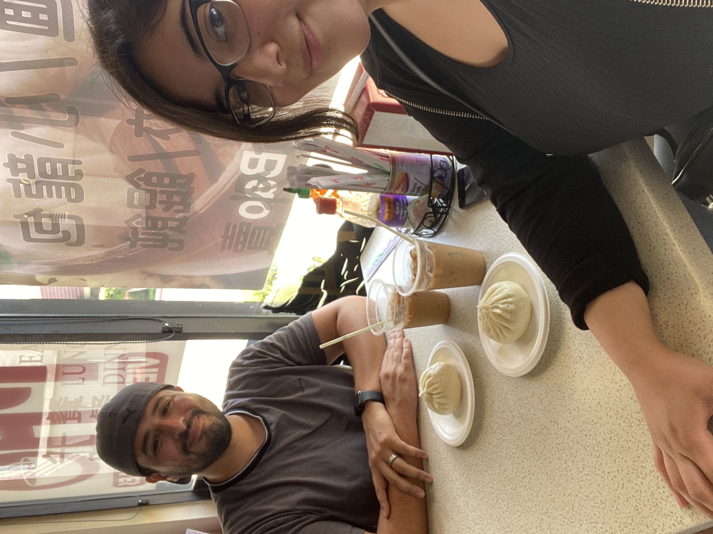
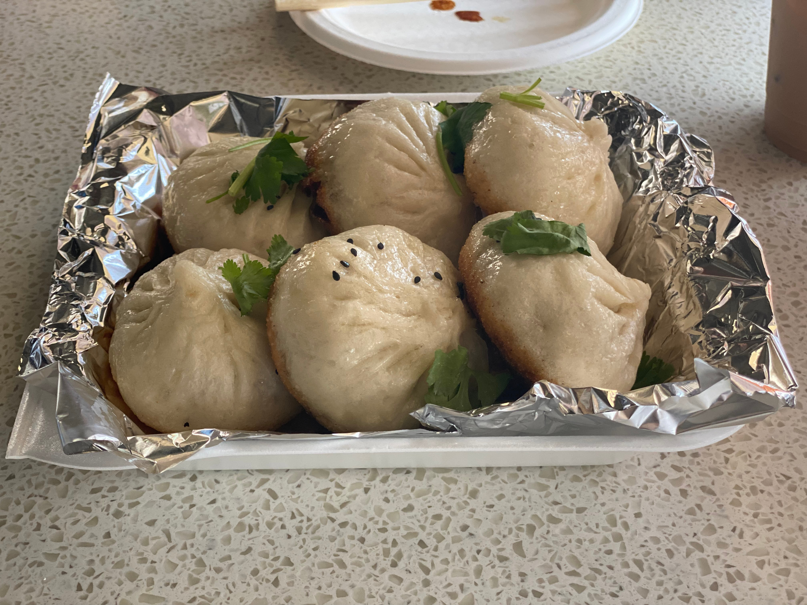

# Dim Sum

Hello everyone! 
For this discussion my wife and I decided to visit a *Dim Sum* restaurant in Monterey Park called *Dim Sum World*. 
It was a delicious experience consisting of *pan fried dumplings* (shown above) washed down by rich, flavor-filled Vietnamese coffee. 
I definitely recommend this restaurant for anyone willing to try a tasty, budget friendly meal filled with some fun facts:

## Where is it from?

While Dim Sum is now eaten all over China and the entire world, the dish is believed to have originated in the southern China's Guangdong region before eventually making its way to Hong Kong (Asia Society, 2023). 
Nowadays, Dim Sum can be ordered with various combinations of seafood, meat, and vegetables as shown in our pan fried dumplings. 
Also, combining this dish with an assortment of sauces can increase the rich umami that these delectable dumplings have to offer.

## What are the spices?

## Extra Details

## References

Society, Asia. 2023. *What Is Dim Sum? The Beginner's Guide to South China's Traditional Brunch Meal*. Asia Society. [https://asiasociety.org/reference/what-dim-sum-beginners-guide-south-chinas-traditional-brunch-meal](https://asiasociety.org/reference/what-dim-sum-beginners-guide-south-chinas-traditional-brunch-meal)
